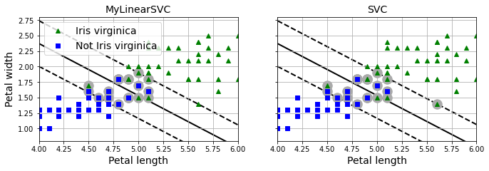
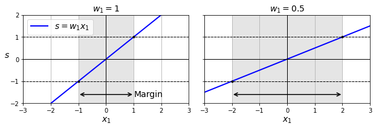

# Máquinas de soporte vectorial / vectores de soporte

Modelo de clasificación y regresión, donde, dado un conjunto de puntos, en el que cada uno de ellos pertenece a una de dos posibles categorías, un algoritmo basado en SVM construye un modelo capaz de predecir si un punto nuevo (cuya categoría desconocemos) pertenece a una categoría o a la otra.

La SVM busca un hiperplano que separe de forma óptima a los puntos de una clase de la de otra, que eventualmente han podido ser previamente proyectados a un espacio de dimensionalidad superior.

Un clasificador linealn SVM predice la clase de una nueva instancia $ x $ a través de una función de decisión tal como se presenta a continuación:

$$
    W^T x + b = w_1 x_1 + \dots + w_n x_n + b
$$

Donde si el resultado es positivo su clase será 1 y 0 para el caso contrario, es decir:

$$
    \check{y} = 
    \begin{cases}
        & 0 \text{ if } \bold{w^T x} + b < 0; \\ 
        & 1 \text{ if } \bold{w^T x} + b \geq 0 
    \end{cases}

$$

De esta funciíon se tiene dos consideraciones:

- Hiperplano. Es la linea de clasifiación

- Márgen. La linea de separación entre las muestras más cercanas al hiperplano. Se pretende dentro de las condiciones del modelo que sean de la misma distancia siempe.

